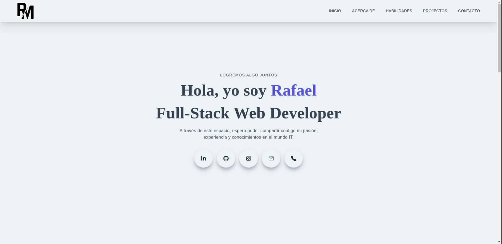

<a name="inicio"></a>

<!-- PROJECT LOGO -->

<div align="center">
  <a href="https://github.com/RafaMojica/FRONT-Porfolio">
    
  </a>

  <p align="center">
    <h3 align="center">PORTAFOLIO</h3>
    <a href="https://rafaelmojica.vercel.app/"><strong>Ver la página Web »</strong></a>
    <br />
    <a href="https://github.com/RafaMojica/FRONT-Porfolio"><strong>Ver el repositorio »</strong></a>
    <br />
  </p>
</div>

<!-- TABLE OF CONTENTS -->

## Tabla de contenido

<ol>
  <li>
    <a href="#descripción-del-proyecto">Descripción del Proyecto</a>
    <ul>
      <li><a href="#tecnologías-utilizadas">Tecnologías utilizadas</a></li>
    </ul>
  </li>
  <li>
    <a href="#cómo-empezar">Cómo Empezar</a>
    <ul>
      <li><a href="#instalación">Instalación</a></li>
    </ul>
  </li>
  <li><a href="#funcionalidades">Funcionalidades</a></li>
  <li><a href="#como-contribuir">Como contribuir</a></li>
  <li><a href="#contacto">Contacto</a></li>
</ol>

<!-- ABOUT THE PROJECT -->

## Descripción del proyecto

Mi portafolio personal web donde conocerás una poco más de mí, aquí encontrarás mis proyectos y trabajos realizados, mostrando mis habilidades y experiencia en el diseño y desarrollo de sitios web y aplicación móvil.

### Tecnologías utilizadas

|                |
|:--------------:|
|  Next          |
|  React         |
|  React Icons   |
|  Aos           |
|  Tailwind      |
|  JavaScript    |

<p align="right"><a href="#inicio">⬆ Volver al inicio</a></p>

<!-- GETTING STARTED -->

## Cómo Empezar

### Instalación

1. Clona el repositorio
   ```sh
   git clone https://github.com/RafaMojica/FRONT-Porfolio.git
   ```
2. Instala las dependencias NPM
   ```sh
   npm install
   ```
3. Corre el servidor
   ```sh
   npm run dev
   ```

<p align="right"><a href="#inicio">⬆ Volver al inicio</a></p>


<!-- FUNCTIONALITIES -->

## Funcionalidades

  - [x] Inicio
  - [x] Sobre Mí
  - [x] Habilidades
  - [x] Proyectos
  - [x] Contacto
  - [x] Observar CV
  - [x] Ir a redes sociales
  - [x] Ir a repositorios, web y ver demos de los proyectos
  - [x] Enviar Mail
  - [x] Versión Móvil

<p align="right"><a href="#inicio">⬆ Volver al inicio</a></p>

<!-- CONTRIBUTING -->

## Como contribuir

<p>¡Las contribuciones de la comunidad Dev nos ayudan a aprender, inspirarnos y crear cosas nuevas ¡Todas las contribuciones son bienvenidas!</p>
<p>Si tienes alguna sugerencia para mejorar el proyecto, por favor realiza un fork del repositorio y crea un pull request</p>

1. Realiza un __Fork__ al proyecto
2. Crea tu rama de desarrollo (`git checkout -b feature/"Nombre de la rama"`)
3. Realiza un commit de los cambios (`git commit -m 'Nombre del commit'`)
4. Realiza un push de la rama (`git push origin feature/"nombre de la rama"`)
5. Abre un Pull Request

<p align="right"><a href="#inicio">⬆ Volver al inicio</a></p>

<!-- CONTACT -->

## Contacto

<p align="center">
    <a href="mailto:rafael.mojica27@gmail.com" target="_blank" rel="noopener noreferrer">
        </a>
    <a href="https://drive.google.com/file/d/1P1VRNPb3dgXHkVWUlvW2f2LmG8UFFunP/view?usp=share_link" target="_blank" rel="noopener noreferrer">
        </a>
    <a href="https://rafaelmojica.vercel.app/" target="_blank" rel="noopener noreferrer">
        </a>
    <a href="https://www.linkedin.com/in/rafamojica/" target="_blank" rel="noopener noreferrer">
        </a>
    <a href="https://www.instagram.com/rafa_mojica_/" target="_blank" rel="noopener noreferrer">
        </a>
    <a href="https://github.com/RafaMojica?tab=repositories" target="_blank" rel="noopener noreferrer">
        </a>
</p>

<p align="right"><a href="#inicio">⬆ Volver al inicio</a></p>
